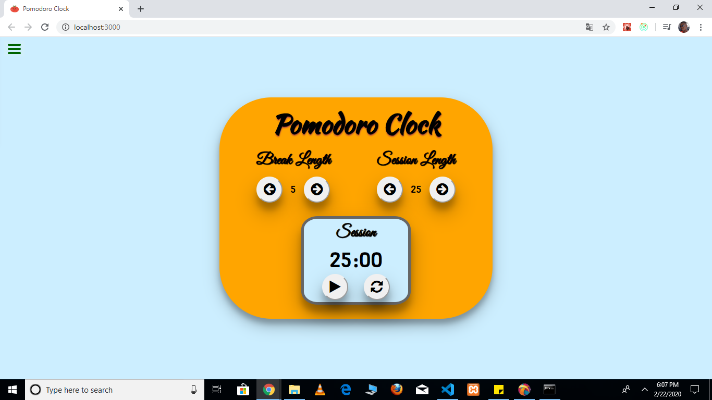

# FreeCodeCamp Pomodoro Clock Project
## A countdown timer that alternates between SESSION and BREAK periods.
### Technology Stack used: ReactJS & Redux 

This React Redux Pomodoro Clock FreeCodeCamp Project was created using both React and Redux.

It has been deployed using this link, click to visit: https://juniorthx3.github.io/react-redux-pomodoro-clock/

